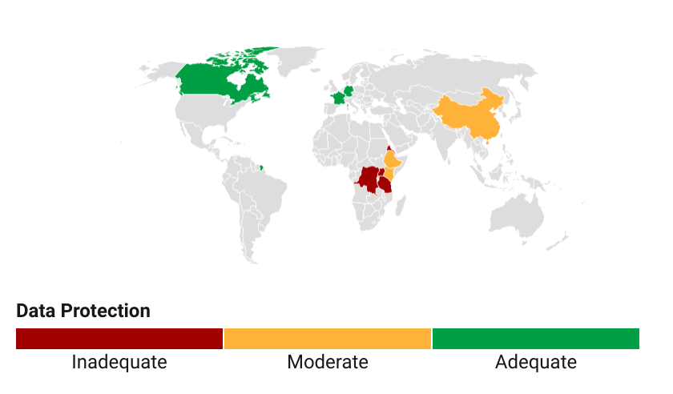
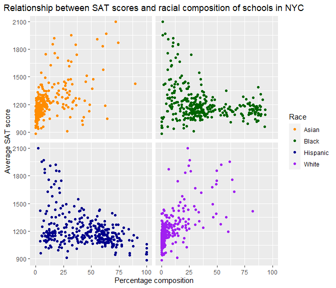

# **Profile**

Academic backgrounds in Environmental Engineering (undergrad) and Economics and Policy analysis (graduate). 
Over 2 years working experience in **performance and growth marketing** and an additional 2 years in **customer success operations**.
  
Having worked with data in both roles and in academia, i would like to share some personal data and insight projects here. I believe data is as useful as the insights extracted from it. This portfolio contains recent data projects and content i have worked on and published. 

## Areas of Interest

1. Data for sustainable development. Econometric analysis (including regression and correlation analysis) for environment, energy, agriculture and natural resource management. E.g. Women's Empowerment in Agriculture under Climate Variability Index

2. Consumer behavior and insights. Clustering and tracking trends/patterns using consumer data to improve decision-making. E.g. [ESG index and visualization for consumer products](https://sustainabilityx.co/how-millennial-consumers-can-help-make-the-world-a-better-place-9e4b30ffde52)

3. Personal passion projects at the intersection of circular economy, digital transformation & economy, sport & fitness. E.g. What my Fitbit say about my last 6 months under lockdown
  

##### [View my LinkedIn](https://www.linkedin.com/in/fredrick-boshe/)
##### [View my Github](https://github.com/rickyboshe)

  
</a>

